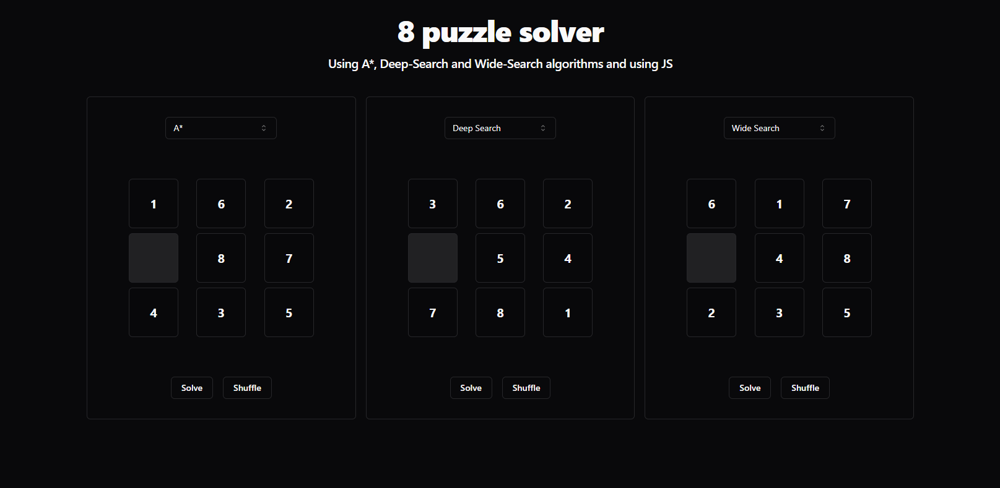

# 8 puzzle solver 🧩

Project for the course of Artificial Intelligence at the University of Western São Paulo (UNOESTE).

We are going to implement a solver for the 8 puzzle problem using various approaches such as Deep-Search, Wide-Search and A* algorithm.

To access the project, click [here](https://8-puzzle-solver.vercel.app/).



## Technologies 💻


## Launching the project 🚀

Install the dependencies:

```bash
# For npm
npm install
# For yarn
yarn install
# For pnpm
pnpm install
```

Run the development server:

```bash
npm run dev
# or
yarn dev
# or
pnpm dev
```

Open [http://localhost:3000](http://localhost:3000) with your browser to see the result.